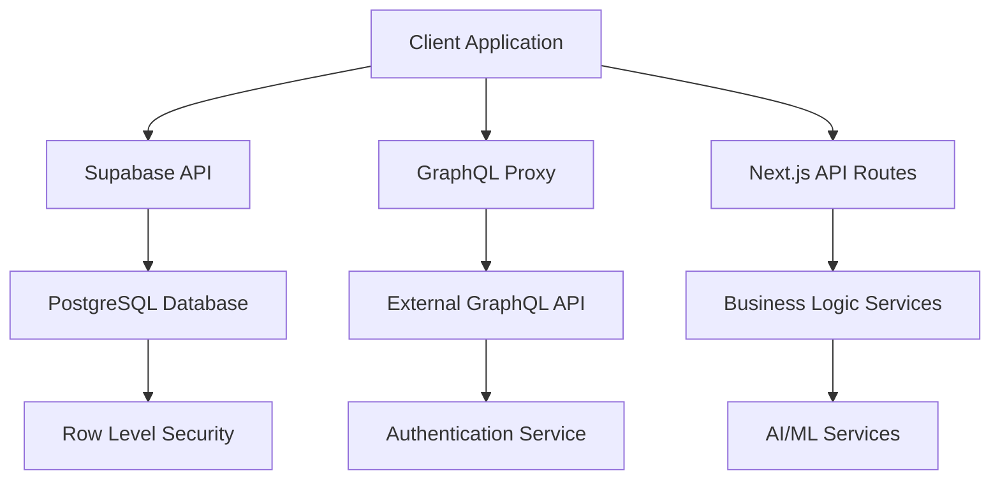

# API Documentation

Comprehensive documentation for Flash Sales Dashboard APIs, including Supabase integration, GraphQL endpoints, and internal API routes.

## 📋 Table of Contents

- [API Overview](#api-overview)
- [Authentication](#authentication)
- [Supabase API](#supabase-api)
- [GraphQL Integration](#graphql-integration)
- [Internal API Routes](#internal-api-routes)
- [Real-time Subscriptions](#real-time-subscriptions)
- [Error Handling](#error-handling)
- [Rate Limiting](#rate-limiting)
- [API Examples](#api-examples)

## 🌐 API Overview

Flash Sales Dashboard uses a **hybrid API architecture** combining multiple data sources:



### API Hierarchy

| Priority | API Type | Purpose | Authentication |
|----------|----------|---------|----------------|
| **1** | **Supabase API** | Primary data operations, real-time features | JWT Token |
| **2** | **GraphQL Proxy** | External authentication integration | API Key |
| **3** | **Next.js API Routes** | Business logic, AI services, utilities | Session-based |

## 🔐 Authentication

### Supabase Authentication

All Supabase API calls use JWT tokens for authentication:

```typescript
// Client-side authentication
import { supabase } from '@/lib/supabase/client';

// Login user
const { data, error } = await supabase.auth.signInWithPassword({
  email: 'user@example.com',
  password: 'password123'
});

// Get current session
const { data: { session } } = await supabase.auth.getSession();

// Use session token for API calls
const { data: profile } = await supabase
  .from('profiles')
  .select('*')
  .eq('id', session?.user.id)
  .single();
```

### GraphQL Authentication

```typescript
// GraphQL authentication (for external API)
const client = new ApolloClient({
  uri: '/api/graphql-proxy',
  headers: {
    'Authorization': `Bearer ${token}`,
    'Content-Type': 'application/json'
  }
});

// Query with authentication
const { data } = await client.query({
  query: gql`
    query GetUser {
      user {
        id
        email
        profile {
          fullName
          territories
        }
      }
    }
  `
});
```

### Session Management

```typescript
// Check authentication status
export const useAuth = () => {
  const [session, setSession] = useState(null);
  const [loading, setLoading] = useState(true);

  useEffect(() => {
    // Get initial session
    supabase.auth.getSession().then(({ data: { session } }) => {
      setSession(session);
      setLoading(false);
    });

    // Listen for auth changes
    const { data: { subscription } } = supabase.auth.onAuthStateChange(
      (event, session) => {
        setSession(session);
        setLoading(false);
      }
    );

    return () => subscription.unsubscribe();
  }, []);

  return { session, loading };
};
```

## 🗄️ Supabase API

### Database Schema

Core tables and their relationships:

```typescript
interface Database {
  public: {
    Tables: {
      profiles: {
        Row: {
          id: string;
          email: string;
          full_name: string;
          territories: string[];
          role: 'admin' | 'manager' | 'rep';
          created_at: string;
          updated_at: string;
        };
      };
      submissions: {
        Row: {
          id: string;
          owner_name: string;
          email: string;
          phone_number?: string;
          territory: string;
          interest_level: number;
          specific_needs?: string;
          form_data: Record<string, any>;
          lead_score?: number;
          status: 'new' | 'contacted' | 'qualified' | 'converted';
          created_at: string;
        };
      };
      deals: {
        Row: {
          id: string;
          organization_id: string;
          owner_id: string;
          status: string;
          value?: number;
          territory: string;
          lead_score?: number;
          created_at: string;
          updated_at: string;
        };
      };
      activities: {
        Row: {
          id: string;
          deal_id?: string;
          contact_id?: string;
          owner_id: string;
          type: string;
          subject: string;
          description?: string;
          status: string;
          created_at: string;
        };
      };
    };
  };
}
```

### CRUD Operations

#### Submissions

```typescript
// Create submission
const createSubmission = async (submissionData: Partial<Submission>) => {
  const { data, error } = await supabase
    .from('submissions')
    .insert([submissionData])
    .select()
    .single();
    
  if (error) throw error;
  return data;
};

// Get submissions by territory
const getSubmissionsByTerritory = async (territory: string) => {
  const { data, error } = await supabase
    .from('submissions')
    .select(`
      *,
      profiles:owner_id (
        full_name,
        email
      )
    `)
    .eq('territory', territory)
    .order('created_at', { ascending: false });
    
  if (error) throw error;
  return data;
};

// Update submission status
const updateSubmissionStatus = async (id: string, status: string) => {
  const { data, error } = await supabase
    .from('submissions')
    .update({ 
      status, 
      updated_at: new Date().toISOString() 
    })
    .eq('id', id)
    .select()
    .single();
    
  if (error) throw error;
  return data;
};

// Delete submission
const deleteSubmission = async (id: string) => {
  const { error } = await supabase
    .from('submissions')
    .delete()
    .eq('id', id);
    
  if (error) throw error;
};
```

#### Deals

```typescript
// Create deal from submission
const createDealFromSubmission = async (submission: Submission) => {
  const dealData = {
    organization_id: await createOrganization(submission),
    owner_id: session?.user.id,
    status: 'new',
    territory: submission.territory,
    lead_score: submission.lead_score,
    source_submission_id: submission.id
  };
  
  const { data, error } = await supabase
    .from('deals')
    .insert([dealData])
    .select()
    .single();
    
  if (error) throw error;
  return data;
};

// Get deals with related data
const getDealsWithDetails = async (territory?: string) => {
  let query = supabase
    .from('deals')
    .select(`
      *,
      organizations (*),
      profiles:owner_id (full_name, email),
      activities (count)
    `);
    
  if (territory) {
    query = query.eq('territory', territory);
  }
  
  const { data, error } = await query
    .order('created_at', { ascending: false });
    
  if (error) throw error;
  return data;
};

// Update deal status
const updateDealStatus = async (dealId: string, status: string) => {
  const { data, error } = await supabase
    .from('deals')
    .update({ 
      status,
      updated_at: new Date().toISOString()
    })
    .eq('id', dealId)
    .select()
    .single();
    
  if (error) throw error;
  return data;
};
```

#### Activities

```typescript
// Log activity
const logActivity = async (activityData: Partial<Activity>) => {
  const { data, error } = await supabase
    .from('activities')
    .insert([{
      ...activityData,
      owner_id: session?.user.id,
      created_at: new Date().toISOString()
    }])
    .select()
    .single();
    
  if (error) throw error;
  return data;
};

// Get activities for deal
const getDealActivities = async (dealId: string) => {
  const { data, error } = await supabase
    .from('activities')
    .select(`
      *,
      profiles:owner_id (full_name)
    `)
    .eq('deal_id', dealId)
    .order('created_at', { ascending: false });
    
  if (error) throw error;
  return data;
};
```

### Advanced Queries

#### Aggregations and Analytics

```typescript
// Territory performance metrics
const getTerritoryMetrics = async (territory: string) => {
  const { data, error } = await supabase
    .rpc('get_territory_metrics', { 
      territory_name: territory 
    });
    
  if (error) throw error;
  return data;
};

// Lead scoring distribution
const getLeadScoreDistribution = async () => {
  const { data, error } = await supabase
    .from('submissions')
    .select('lead_score, territory')
    .not('lead_score', 'is', null);
    
  if (error) throw error;
  
  // Process data for chart
  const distribution = data.reduce((acc, item) => {
    const scoreRange = Math.floor(item.lead_score / 10) * 10;
    const key = `${scoreRange}-${scoreRange + 9}`;
    
    if (!acc[key]) acc[key] = { range: key, count: 0, territories: {} };
    acc[key].count++;
    acc[key].territories[item.territory] = (acc[key].territories[item.territory] || 0) + 1;
    
    return acc;
  }, {});
  
  return Object.values(distribution);
};
```

#### Custom SQL Functions

```sql
-- Example: Territory performance function
CREATE OR REPLACE FUNCTION get_territory_metrics(territory_name TEXT)
RETURNS TABLE(
  total_submissions BIGINT,
  converted_leads BIGINT,
  conversion_rate NUMERIC,
  avg_lead_score NUMERIC,
  total_deal_value NUMERIC
) AS $$
BEGIN
  RETURN QUERY
  SELECT 
    COUNT(s.id)::BIGINT as total_submissions,
    COUNT(d.id)::BIGINT as converted_leads,
    CASE 
      WHEN COUNT(s.id) > 0 
      THEN ROUND((COUNT(d.id)::NUMERIC / COUNT(s.id)::NUMERIC) * 100, 2)
      ELSE 0
    END as conversion_rate,
    ROUND(AVG(s.lead_score), 2) as avg_lead_score,
    COALESCE(SUM(d.value), 0) as total_deal_value
  FROM submissions s
  LEFT JOIN deals d ON s.id = d.source_submission_id
  WHERE s.territory = territory_name
    AND s.created_at >= CURRENT_DATE - INTERVAL '30 days';
END;
$$ LANGUAGE plpgsql;
```

## 🔌 GraphQL Integration

### GraphQL Proxy

The GraphQL proxy handles external authentication:

```typescript
// pages/api/graphql-proxy.ts
export default async function handler(req: NextApiRequest, res: NextApiResponse) {
  if (req.method !== 'POST') {
    return res.status(405).json({ error: 'Method not allowed' });
  }

  try {
    const response = await fetch(GRAPHQL_URI, {
      method: 'POST',
      headers: {
        'Content-Type': 'application/json',
        'Authorization': req.headers.authorization,
      },
      body: JSON.stringify(req.body),
    });

    const data = await response.json();
    res.status(response.status).json(data);
  } catch (error) {
    res.status(500).json({ 
      error: 'Failed to connect to GraphQL server',
      message: error.message 
    });
  }
}
```

### GraphQL Queries

```typescript
// Authentication queries
export const LOGIN_MUTATION = gql`
  mutation Login($email: String!, $password: String!) {
    login(email: $email, password: $password) {
      token
      user {
        id
        email
        profile {
          fullName
          role
          territories
        }
      }
    }
  }
`;

export const GET_USER_PROFILE = gql`
  query GetUserProfile {
    user {
      id
      email
      profile {
        fullName
        role
        territories
        preferences
      }
    }
  }
`;

// Usage with Apollo Client
const useLogin = () => {
  const [login] = useMutation(LOGIN_MUTATION);
  
  return async (email: string, password: string) => {
    const { data } = await login({
      variables: { email, password }
    });
    
    return data.login;
  };
};
```

## 🛣️ Internal API Routes

### Configuration API

```typescript
// pages/api/config.ts
export default function handler(req: NextApiRequest, res: NextApiResponse) {
  const config = {
    supabaseConfigured: isSupabaseConfigured(),
    environment: process.env.NEXT_PUBLIC_APP_ENV || 'development',
    features: {
      realtime: process.env.NEXT_PUBLIC_ENABLE_REALTIME === 'true',
      aiFeatures: process.env.NEXT_PUBLIC_ENABLE_AI_FEATURES === 'true',
    },
    territories: ['jamaica', 'cayman', 'curacao']
  };
  
  res.status(200).json(config);
}
```

### Statistics API

```typescript
// pages/api/submissions/stats.ts
export default async function handler(req: NextApiRequest, res: NextApiResponse) {
  const { territory, dateRange } = req.query;
  
  try {
    // Calculate date range
    const endDate = new Date();
    const startDate = new Date();
    startDate.setDate(endDate.getDate() - (parseInt(dateRange as string) || 30));
    
    // Get stats from Supabase
    const { data, error } = await supabase
      .from('submissions')
      .select('*')
      .eq('territory', territory)
      .gte('created_at', startDate.toISOString())
      .lte('created_at', endDate.toISOString());
      
    if (error) throw error;
    
    // Calculate statistics
    const stats = {
      totalSubmissions: data.length,
      averageLeadScore: data.reduce((sum, s) => sum + (s.lead_score || 0), 0) / data.length,
      conversionRate: data.filter(s => s.status === 'converted').length / data.length,
      byDay: groupByDay(data),
      byInterestLevel: groupByInterestLevel(data)
    };
    
    res.status(200).json(stats);
  } catch (error) {
    res.status(500).json({ error: error.message });
  }
}
```

### Rep Tracking API

```typescript
// pages/api/rep-tracking/stats.ts
export default async function handler(req: NextApiRequest, res: NextApiResponse) {
  const { repId, territory } = req.query;
  
  try {
    const stats = await calculateRepPerformance(repId as string, territory as string);
    res.status(200).json(stats);
  } catch (error) {
    res.status(500).json({ error: error.message });
  }
}

// Helper function
async function calculateRepPerformance(repId: string, territory: string) {
  const { data: deals } = await supabase
    .from('deals')
    .select('*')
    .eq('owner_id', repId)
    .eq('territory', territory);
    
  const { data: activities } = await supabase
    .from('activities')
    .select('*')
    .eq('owner_id', repId);
    
  return {
    totalDeals: deals.length,
    closedDeals: deals.filter(d => d.status === 'closed').length,
    totalActivities: activities.length,
    averageDealValue: deals.reduce((sum, d) => sum + (d.value || 0), 0) / deals.length,
    conversionRate: deals.filter(d => d.status === 'closed').length / deals.length
  };
}
```

## 🔄 Real-time Subscriptions

### Supabase Real-time

```typescript
// Real-time subscription hooks
export const useRealtimeSubmissions = (territory: string) => {
  const [submissions, setSubmissions] = useState<Submission[]>([]);
  
  useEffect(() => {
    // Initial fetch
    fetchSubmissions(territory).then(setSubmissions);
    
    // Real-time subscription
    const channel = supabase
      .channel(`submissions:${territory}`)
      .on('postgres_changes', {
        event: '*',
        schema: 'public',
        table: 'submissions',
        filter: `territory=eq.${territory}`
      }, (payload) => {
        handleRealtimeUpdate(payload, setSubmissions);
      })
      .subscribe();
      
    return () => {
      supabase.removeChannel(channel);
    };
  }, [territory]);
  
  return submissions;
};

// Handle real-time updates
const handleRealtimeUpdate = (payload: any, setData: Function) => {
  const { eventType, new: newRecord, old: oldRecord } = payload;
  
  setData((current: any[]) => {
    switch (eventType) {
      case 'INSERT':
        return [newRecord, ...current];
      case 'UPDATE':
        return current.map(item => 
          item.id === newRecord.id ? newRecord : item
        );
      case 'DELETE':
        return current.filter(item => item.id !== oldRecord.id);
      default:
        return current;
    }
  });
};
```

### Presence System

```typescript
// User presence tracking
export const usePresence = (channel: string) => {
  const [users, setUsers] = useState<PresenceUser[]>([]);
  const { session } = useAuth();
  
  useEffect(() => {
    if (!session) return;
    
    const presenceChannel = supabase.channel(channel, {
      config: { presence: { key: session.user.id } }
    });
    
    presenceChannel
      .on('presence', { event: 'sync' }, () => {
        const state = presenceChannel.presenceState();
        const users = Object.values(state).flat() as PresenceUser[];
        setUsers(users);
      })
      .on('presence', { event: 'join' }, ({ key, newPresences }) => {
        console.log('User joined:', key, newPresences);
      })
      .on('presence', { event: 'leave' }, ({ key, leftPresences }) => {
        console.log('User left:', key, leftPresences);
      })
      .subscribe(async (status) => {
        if (status === 'SUBSCRIBED') {
          await presenceChannel.track({
            id: session.user.id,
            email: session.user.email,
            full_name: session.user.user_metadata?.full_name,
            online_at: new Date().toISOString()
          });
        }
      });
      
    return () => {
      presenceChannel.unsubscribe();
    };
  }, [channel, session]);
  
  return users;
};
```

## 🚨 Error Handling

### Standardized Error Responses

```typescript
// Error response interface
interface APIError {
  error: string;
  message: string;
  code?: string;
  details?: any;
  timestamp: string;
}

// Error handling utility
export const handleAPIError = (error: any): APIError => {
  return {
    error: error.name || 'APIError',
    message: error.message || 'An unexpected error occurred',
    code: error.code,
    details: process.env.NODE_ENV === 'development' ? error.stack : undefined,
    timestamp: new Date().toISOString()
  };
};

// Usage in API routes
export default async function handler(req: NextApiRequest, res: NextApiResponse) {
  try {
    // API logic here
  } catch (error) {
    const apiError = handleAPIError(error);
    res.status(500).json(apiError);
  }
}
```

### Client-side Error Handling

```typescript
// React Query error handling
export const useSubmissions = (territory: string) => {
  return useQuery({
    queryKey: ['submissions', territory],
    queryFn: () => fetchSubmissions(territory),
    onError: (error) => {
      console.error('Failed to fetch submissions:', error);
      // Show user-friendly error message
      toast.error('Failed to load submissions. Please try again.');
    }
  });
};

// Supabase error handling
const createSubmission = async (data: Partial<Submission>) => {
  const { data: result, error } = await supabase
    .from('submissions')
    .insert([data])
    .select()
    .single();
    
  if (error) {
    // Handle specific error types
    switch (error.code) {
      case '23505': // Unique constraint violation
        throw new Error('A submission with this email already exists');
      case '42501': // Insufficient privileges
        throw new Error('You do not have permission to create submissions');
      default:
        throw new Error(`Database error: ${error.message}`);
    }
  }
  
  return result;
};
```

## ⚡ Rate Limiting

### API Rate Limiting

```typescript
// Simple rate limiting for API routes
const rateLimitMap = new Map();

export const rateLimit = (limit: number, windowMs: number) => {
  return (req: NextApiRequest, res: NextApiResponse, next: Function) => {
    const key = req.headers['x-forwarded-for'] || req.socket.remoteAddress;
    const now = Date.now();
    const windowStart = now - windowMs;
    
    const requests = rateLimitMap.get(key) || [];
    const recentRequests = requests.filter(time => time > windowStart);
    
    if (recentRequests.length >= limit) {
      return res.status(429).json({
        error: 'Too Many Requests',
        message: `Rate limit exceeded. Try again in ${Math.ceil(windowMs / 1000)} seconds.`
      });
    }
    
    recentRequests.push(now);
    rateLimitMap.set(key, recentRequests);
    
    next();
  };
};

// Usage
export default rateLimit(10, 60000)( // 10 requests per minute
  async function handler(req: NextApiRequest, res: NextApiResponse) {
    // API logic
  }
);
```

## 📚 API Examples

### Complete Lead Management Example

```typescript
// Lead management service
export class LeadManagementService {
  // Create lead from form submission
  async createLead(formData: IntakeFormData): Promise<Lead> {
    // Validate data
    const validatedData = IntakeFormSchema.parse(formData);
    
    // Calculate lead score
    const leadScore = await this.calculateLeadScore(validatedData);
    
    // Create submission
    const { data: submission, error } = await supabase
      .from('submissions')
      .insert([{
        ...validatedData,
        lead_score: leadScore,
        status: 'new'
      }])
      .select()
      .single();
      
    if (error) throw error;
    
    // Create deal if score is high enough
    if (leadScore >= 70) {
      await this.createDealFromSubmission(submission);
    }
    
    // Send notifications
    await this.notifyRelevantReps(submission);
    
    return submission;
  }
  
  // Update lead status
  async updateLeadStatus(leadId: string, status: LeadStatus): Promise<Lead> {
    const { data, error } = await supabase
      .from('submissions')
      .update({ 
        status,
        updated_at: new Date().toISOString()
      })
      .eq('id', leadId)
      .select()
      .single();
      
    if (error) throw error;
    
    // Log activity
    await this.logActivity({
      type: 'status_change',
      subject: `Status changed to ${status}`,
      lead_id: leadId
    });
    
    return data;
  }
  
  // Get leads with filtering
  async getLeads(filters: LeadFilters): Promise<Lead[]> {
    let query = supabase
      .from('submissions')
      .select(`
        *,
        deals (
          id,
          status,
          value
        ),
        activities (count)
      `);
      
    // Apply filters
    if (filters.territory) {
      query = query.eq('territory', filters.territory);
    }
    
    if (filters.status) {
      query = query.eq('status', filters.status);
    }
    
    if (filters.minScore) {
      query = query.gte('lead_score', filters.minScore);
    }
    
    if (filters.dateRange) {
      query = query
        .gte('created_at', filters.dateRange.start)
        .lte('created_at', filters.dateRange.end);
    }
    
    const { data, error } = await query
      .order('created_at', { ascending: false })
      .limit(filters.limit || 50);
      
    if (error) throw error;
    return data;
  }
}

// Usage in React component
const LeadDashboard = () => {
  const { data: leads, isLoading, error } = useQuery({
    queryKey: ['leads', { territory: 'jamaica', status: 'new' }],
    queryFn: () => leadService.getLeads({ 
      territory: 'jamaica', 
      status: 'new' 
    })
  });
  
  const updateStatusMutation = useMutation({
    mutationFn: ({ leadId, status }) => 
      leadService.updateLeadStatus(leadId, status),
    onSuccess: () => {
      queryClient.invalidateQueries(['leads']);
      toast.success('Lead status updated successfully');
    }
  });
  
  if (isLoading) return <LoadingSpinner />;
  if (error) return <ErrorMessage error={error} />;
  
  return (
    <div className="lead-dashboard">
      {leads.map(lead => (
        <LeadCard 
          key={lead.id}
          lead={lead}
          onStatusChange={(status) => 
            updateStatusMutation.mutate({ leadId: lead.id, status })
          }
        />
      ))}
    </div>
  );
};
```

### Real-time Dashboard Example

```typescript
// Real-time dashboard hook
export const useRealtimeDashboard = (territory: string) => {
  const [metrics, setMetrics] = useState<DashboardMetrics>({
    totalLeads: 0,
    newLeads: 0,
    activeDeals: 0,
    revenue: 0
  });
  
  useEffect(() => {
    // Initial data load
    loadDashboardMetrics(territory).then(setMetrics);
    
    // Real-time subscriptions
    const submissionsChannel = supabase
      .channel(`dashboard:submissions:${territory}`)
      .on('postgres_changes', {
        event: '*',
        schema: 'public',
        table: 'submissions',
        filter: `territory=eq.${territory}`
      }, () => {
        // Reload metrics when submissions change
        loadDashboardMetrics(territory).then(setMetrics);
      })
      .subscribe();
      
    const dealsChannel = supabase
      .channel(`dashboard:deals:${territory}`)
      .on('postgres_changes', {
        event: '*',
        schema: 'public',
        table: 'deals',
        filter: `territory=eq.${territory}`
      }, () => {
        // Reload metrics when deals change
        loadDashboardMetrics(territory).then(setMetrics);
      })
      .subscribe();
      
    return () => {
      supabase.removeChannel(submissionsChannel);
      supabase.removeChannel(dealsChannel);
    };
  }, [territory]);
  
  return metrics;
};

// Usage
const DashboardMetrics = ({ territory }) => {
  const metrics = useRealtimeDashboard(territory);
  const onlineUsers = usePresence(`dashboard:${territory}`);
  
  return (
    <div className="dashboard-metrics">
      <div className="metrics-grid">
        <MetricCard 
          title="Total Leads" 
          value={metrics.totalLeads}
          trend="+12%" 
        />
        <MetricCard 
          title="New Leads" 
          value={metrics.newLeads}
          trend="+5%" 
        />
        <MetricCard 
          title="Active Deals" 
          value={metrics.activeDeals}
          trend="-2%" 
        />
        <MetricCard 
          title="Revenue" 
          value={`$${metrics.revenue.toLocaleString()}`}
          trend="+18%" 
        />
      </div>
      
      <div className="online-users">
        <h3>Online Users ({onlineUsers.length})</h3>
        {onlineUsers.map(user => (
          <UserPresenceIndicator key={user.id} user={user} />
        ))}
      </div>
    </div>
  );
};
```

---

## 📞 API Support

For API-related questions and issues:

- **📖 Documentation**: Review this guide and related docs
- **🐛 Issues**: Create GitHub issue with API details
- **💬 Community**: Join discussions for API help
- **🔍 Debugging**: Use browser dev tools and server logs

The API is designed to be intuitive and type-safe, with comprehensive error handling and real-time capabilities built in.