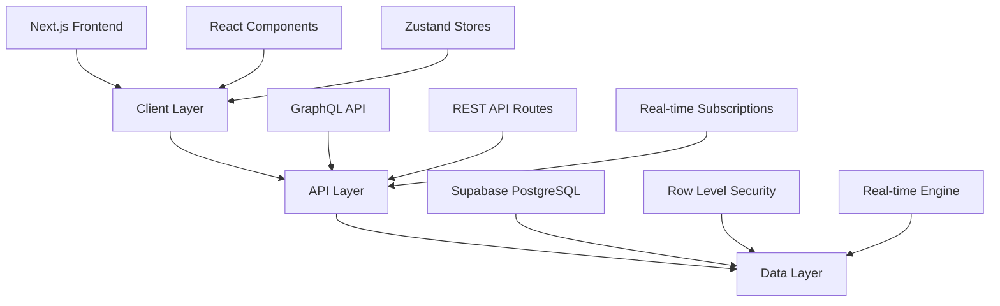
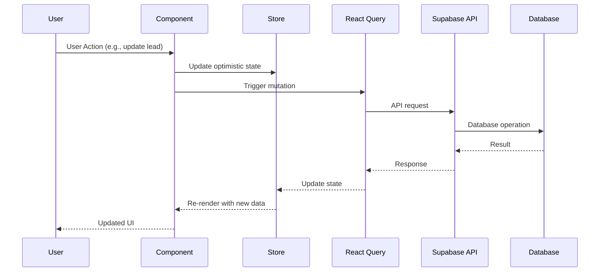
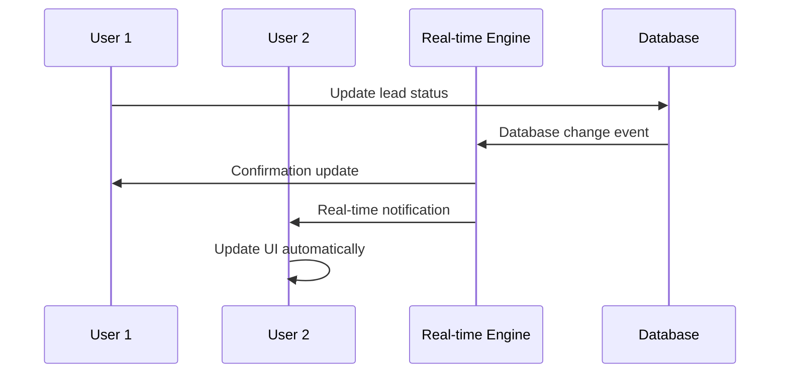
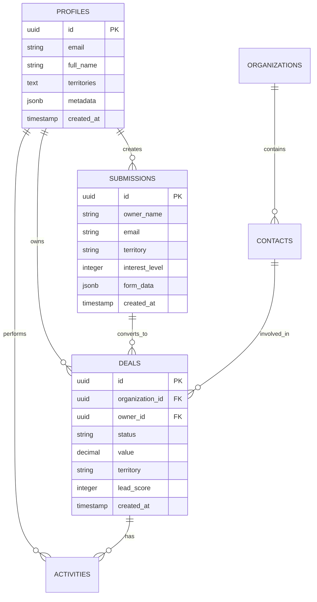
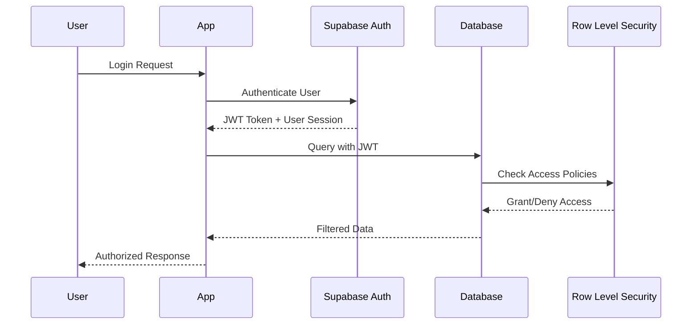

# System Architecture

This document provides a comprehensive overview of the Flash Sales Dashboard architecture, including system design, data flow, component relationships, and technical decisions.

## 📋 Table of Contents

- [Architecture Overview](#architecture-overview)
- [System Components](#system-components)
- [Data Flow](#data-flow)
- [Frontend Architecture](#frontend-architecture)
- [Backend Architecture](#backend-architecture)
- [Database Design](#database-design)
- [Real-time Features](#real-time-features)
- [AI & Machine Learning](#ai--machine-learning)
- [Security Architecture](#security-architecture)
- [Performance Considerations](#performance-considerations)
- [Deployment Architecture](#deployment-architecture)

## 🏗️ Architecture Overview

Flash Sales Dashboard follows a **modern JAMstack architecture** with real-time capabilities, built around three main pillars:



### Core Principles

1. **Serverless-First**: Leveraging managed services for scalability
2. **Real-time by Design**: Live collaboration and instant updates
3. **Type Safety**: End-to-end TypeScript for reliability
4. **Territory-Aware**: Multi-region data isolation and routing
5. **AI-Enhanced**: Machine learning for lead scoring and insights

## 🔧 System Components

### High-Level Component Diagram

```
┌─────────────────────────────────────────────────────────────┐
│                    CLIENT LAYER                             │
├─────────────────────────────────────────────────────────────┤
│ Next.js App Router │ React Components │ Zustand Stores     │
│ TailwindCSS       │ React Query      │ Real-time Hooks    │
└─────────────────────────────────────────────────────────────┘
                                │
                                ▼
┌─────────────────────────────────────────────────────────────┐
│                    API LAYER                                │
├─────────────────────────────────────────────────────────────┤
│ GraphQL Proxy     │ Next.js API Routes │ Supabase Auth     │
│ Lead Scoring API  │ Data Enrichment    │ Real-time Channels│
└─────────────────────────────────────────────────────────────┘
                                │
                                ▼
┌─────────────────────────────────────────────────────────────┐
│                    DATA LAYER                               │
├─────────────────────────────────────────────────────────────┤
│ Supabase PostgreSQL │ Row Level Security │ Real-time Engine│
│ GraphQL Engine      │ Authentication     │ Storage Buckets │
└─────────────────────────────────────────────────────────────┘
```

### Component Responsibilities

| Component | Responsibility |
|-----------|----------------|
| **Next.js Frontend** | Server-side rendering, routing, client-side hydration |
| **React Components** | UI rendering, user interactions, local state management |
| **Zustand Stores** | Global state management, cross-component data sharing |
| **TanStack Query** | Server state management, caching, synchronization |
| **Supabase Client** | Database queries, authentication, real-time subscriptions |
| **GraphQL Proxy** | External API integration, CORS handling |
| **AI Services** | Lead scoring, predictive analytics, recommendations |

## 📊 Data Flow

### User Interaction Flow



### Real-time Data Flow



### Lead Processing Pipeline

```
Lead Submission → Validation → Territory Routing → AI Scoring → Assignment → Notification
     │               │              │               │            │            │
     ▼               ▼              ▼               ▼            ▼            ▼
Dynamic Form    Zod Schema    Lead Router    AI Service    Auto-Assign    Real-time
Validation      Validation    Algorithm      Scoring       Algorithm      Updates
```

## 🎨 Frontend Architecture

### Component Hierarchy

```
App Layout
├── Dashboard Layout
│   ├── Header
│   │   ├── Navigation
│   │   ├── User Menu
│   │   └── Territory Selector
│   ├── Sidebar
│   │   ├── Navigation Menu
│   │   └── Collapsible Sections
│   └── Main Content
│       ├── Dashboard Grid
│       │   ├── Stats Widgets
│       │   ├── Chart Widgets
│       │   └── Activity Feeds
│       ├── Lead Management
│       │   ├── Lead Table
│       │   ├── Lead Filters
│       │   └── Lead Actions
│       └── Territory Dashboard
│           ├── Territory Stats
│           ├── Rep Performance
│           └── Pipeline Analysis
```

### State Management Architecture

```typescript
// Global Store Structure
interface AppState {
  auth: AuthState;           // User authentication & profile
  sales: SalesState;         // Deals, leads, performance data  
  territory: TerritoryState; // Territory-specific data
  ui: UIState;              // Layout, theme, notifications
  realtime: RealtimeState;  // Live user presence, updates
}

// Store Composition
const useAppStore = () => ({
  ...useAuthStore(),
  ...useSalesStore(), 
  ...useTerritoryStore(),
  ...useUIStore(),
  ...useRealtimeStore()
});
```

### Component Design Patterns

1. **Container/Presentational Pattern**
   ```typescript
   // Container component handles data and logic
   const LeadManagementContainer = () => {
     const { leads, updateLead } = useLeads();
     const { currentTerritory } = useTerritory();
     
     return (
       <LeadManagement 
         leads={leads}
         territory={currentTerritory}
         onUpdateLead={updateLead}
       />
     );
   };
   
   // Presentational component handles UI
   const LeadManagement = ({ leads, territory, onUpdateLead }) => {
     // Pure UI rendering logic
   };
   ```

2. **Compound Component Pattern**
   ```typescript
   // Dashboard composed of multiple widgets
   const Dashboard = () => (
     <DashboardGrid>
       <DashboardGrid.StatsWidget />
       <DashboardGrid.ChartWidget />
       <DashboardGrid.ActivityFeed />
     </DashboardGrid>
   );
   ```

3. **Hooks-First Architecture**
   ```typescript
   // Custom hooks encapsulate business logic
   const useLeadManagement = (territory: string) => {
     const { data: leads } = useQuery(['leads', territory], fetchLeads);
     const mutation = useMutation(updateLead);
     
     return {
       leads,
       updateLead: mutation.mutate,
       isLoading: mutation.isLoading
     };
   };
   ```

## ⚙️ Backend Architecture

### API Layer Design

```typescript
// API Route Structure
pages/api/
├── graphql-proxy.ts          // External GraphQL API proxy
├── submissions/
│   ├── index.ts             // CRUD operations for submissions
│   ├── [id].ts              // Individual submission operations
│   └── stats.ts             // Aggregated statistics
├── rep-tracking/
│   ├── index.ts             // Rep performance tracking
│   └── stats.ts             // Performance statistics
└── config.ts                // Runtime configuration
```

### Service Layer Architecture

```typescript
// Services handle business logic
export class LeadScoringService {
  async calculateScore(lead: Lead): Promise<LeadScore> {
    // AI-powered scoring logic
  }
  
  async getPredictiveInsights(lead: Lead): Promise<Insights> {
    // Predictive analytics
  }
}

export class TerritoryService {
  async assignTerritory(lead: Lead): Promise<Territory> {
    // Territory assignment logic
  }
  
  async getPerformanceMetrics(territory: string): Promise<Metrics> {
    // Territory performance calculation
  }
}
```

### Data Access Layer

```typescript
// Supabase client with type safety
export const supabaseApi = {
  // Generic CRUD operations
  async query<T>(table: string, filters?: any): Promise<T[]> {
    const { data, error } = await supabase
      .from(table)
      .select('*')
      .match(filters);
    
    if (error) throw error;
    return data as T[];
  },
  
  // Specialized queries
  async getLeadsByTerritory(territory: string): Promise<Lead[]> {
    return this.query<Lead>('leads', { territory });
  },
  
  // Real-time subscriptions
  subscribeToTable<T>(table: string, callback: (data: T) => void) {
    return supabase
      .channel(`public:${table}`)
      .on('postgres_changes', { 
        event: '*', 
        schema: 'public', 
        table 
      }, callback)
      .subscribe();
  }
};
```

## 💾 Database Design

### Core Entity Relationships



### Territory-Based Data Isolation

```sql
-- Row Level Security policies for territory isolation
CREATE POLICY "Users can only access their territory data" 
ON submissions FOR ALL 
USING (
  territory = ANY(
    SELECT unnest(territories) 
    FROM profiles 
    WHERE id = auth.uid()
  )
);

-- Multi-territory access for admins
CREATE POLICY "Admins can access all territories"
ON submissions FOR ALL
TO admin_role
USING (true);
```

### Performance Optimization

```sql
-- Indexes for common queries
CREATE INDEX idx_submissions_territory_created 
ON submissions(territory, created_at DESC);

CREATE INDEX idx_deals_owner_status 
ON deals(owner_id, status) WHERE status != 'closed';

CREATE INDEX idx_activities_deal_created 
ON activities(deal_id, created_at DESC);

-- Materialized views for analytics
CREATE MATERIALIZED VIEW territory_performance AS
SELECT 
  territory,
  COUNT(*) as total_leads,
  COUNT(*) FILTER (WHERE status = 'converted') as conversions,
  AVG(lead_score) as avg_score
FROM submissions
GROUP BY territory;
```

## 🔄 Real-time Features

### Real-time Architecture

```typescript
// Real-time subscription management
class RealtimeManager {
  private channels: Map<string, RealtimeChannel> = new Map();
  
  subscribe(table: string, callback: (payload: any) => void) {
    const channelName = `public:${table}`;
    
    if (!this.channels.has(channelName)) {
      const channel = supabase
        .channel(channelName)
        .on('postgres_changes', {
          event: '*',
          schema: 'public',
          table
        }, callback)
        .subscribe();
        
      this.channels.set(channelName, channel);
    }
    
    return () => this.unsubscribe(channelName);
  }
  
  unsubscribe(channelName: string) {
    const channel = this.channels.get(channelName);
    if (channel) {
      supabase.removeChannel(channel);
      this.channels.delete(channelName);
    }
  }
}
```

### Presence System

```typescript
// User presence tracking
export const usePresence = (channel: string) => {
  const [users, setUsers] = useState<User[]>([]);
  
  useEffect(() => {
    const presenceChannel = supabase.channel(channel, {
      config: { presence: { key: 'user-presence' } }
    });
    
    presenceChannel
      .on('presence', { event: 'sync' }, () => {
        const state = presenceChannel.presenceState();
        setUsers(Object.values(state).flat());
      })
      .subscribe(async (status) => {
        if (status === 'SUBSCRIBED') {
          await presenceChannel.track({
            user: currentUser,
            online_at: new Date().toISOString()
          });
        }
      });
      
    return () => {
      presenceChannel.unsubscribe();
    };
  }, [channel]);
  
  return users;
};
```

## 🤖 AI & Machine Learning

### AI Service Architecture

```typescript
// AI-powered lead scoring system
export class AILeadScoringService {
  private modelEndpoint: string;
  private cacheService: CacheService;
  
  async calculateScore(leadData: LeadData): Promise<AILeadScoringResult> {
    // Check cache first
    const cached = await this.cacheService.get(`score:${leadData.id}`);
    if (cached) return cached;
    
    // Calculate basic score
    const basicScore = this.calculateBasicScore(leadData);
    
    // Enhance with historical data
    const historicalData = await this.getHistoricalComparisons(leadData);
    
    // Apply ML model (when available)
    const mlScore = await this.applyMLModel(leadData, historicalData);
    
    const result = {
      score: mlScore || basicScore,
      confidence: mlScore ? 0.85 : 0.65,
      factors: this.identifyScoreFactors(leadData),
      predictedOutcome: this.predictOutcome(leadData, historicalData),
      recommendations: this.generateRecommendations(leadData),
      historicalComparison: historicalData
    };
    
    // Cache result
    await this.cacheService.set(`score:${leadData.id}`, result, 3600);
    
    return result;
  }
  
  private calculateBasicScore(leadData: LeadData): number {
    let score = 50; // Base score
    
    // Revenue factor
    if (leadData.monthlyRevenue) {
      const revenue = this.parseRevenue(leadData.monthlyRevenue);
      score += Math.min(revenue / 10000 * 20, 30);
    }
    
    // Employee count factor
    if (leadData.numberOfEmployees) {
      const employees = this.parseEmployees(leadData.numberOfEmployees);
      score += Math.min(employees / 10 * 15, 20);
    }
    
    // Interest level factor
    score += leadData.interestLevel * 2;
    
    return Math.min(Math.max(score, 0), 100);
  }
}
```

### Lead Routing Intelligence

```typescript
// Intelligent lead routing system
export class LeadRoutingService {
  async assignLead(lead: Lead, availableReps: SalesRep[]): Promise<RoutingAssignment> {
    const routingRules = await this.getRoutingRules();
    
    // Apply rules in priority order
    for (const rule of routingRules.sort((a, b) => a.priority - b.priority)) {
      if (rule.condition(lead)) {
        const assignment = rule.assignmentLogic(lead, availableReps);
        if (assignment) {
          return {
            assignedRep: assignment,
            rule: rule.name,
            confidence: this.calculateAssignmentConfidence(lead, assignment),
            reasoning: this.generateAssignmentReasoning(lead, assignment, rule)
          };
        }
      }
    }
    
    // Fallback to round-robin assignment
    return this.roundRobinAssignment(lead, availableReps);
  }
  
  private calculateAssignmentConfidence(lead: Lead, rep: SalesRep): number {
    let confidence = 0.5; // Base confidence
    
    // Territory match increases confidence
    if (rep.territories.includes(lead.territory)) {
      confidence += 0.3;
    }
    
    // Experience with similar leads
    const similarLeadsHandled = rep.performance.dealsByType[lead.businessType] || 0;
    confidence += Math.min(similarLeadsHandled / 10 * 0.2, 0.2);
    
    return Math.min(confidence, 1.0);
  }
}
```

## 🔐 Security Architecture

### Authentication & Authorization Flow



### Row Level Security Implementation

```sql
-- Territory-based access control
CREATE FUNCTION auth.user_territories() 
RETURNS text[] 
LANGUAGE sql 
SECURITY DEFINER
AS $$
  SELECT territories 
  FROM profiles 
  WHERE id = auth.uid();
$$;

-- RLS policy for submissions
CREATE POLICY "Territory-based submission access"
ON submissions FOR ALL
USING (
  territory = ANY(auth.user_territories())
  OR auth.jwt() ->> 'role' = 'admin'
);

-- RLS policy for deals
CREATE POLICY "Owner or territory-based deal access"
ON deals FOR ALL
USING (
  owner_id = auth.uid()
  OR territory = ANY(auth.user_territories())
  OR auth.jwt() ->> 'role' = 'admin'
);
```

### Data Protection Measures

1. **Encryption at Rest**: All sensitive data encrypted in database
2. **Encryption in Transit**: HTTPS/WSS for all communications
3. **Input Validation**: Zod schemas for all user inputs
4. **SQL Injection Prevention**: Parameterized queries only
5. **XSS Protection**: Content Security Policy headers
6. **CSRF Protection**: Same-site cookies and CSRF tokens

## ⚡ Performance Considerations

### Frontend Performance

```typescript
// Code splitting and lazy loading
const DashboardChart = dynamic(
  () => import('@/components/dashboard/DashboardChart'),
  { 
    loading: () => <ChartSkeleton />,
    ssr: false // Client-side only for heavy charts
  }
);

// Memoization for expensive calculations
const ExpensiveComponent = memo(({ data }) => {
  const processedData = useMemo(() => {
    return heavyDataProcessing(data);
  }, [data]);
  
  return <Chart data={processedData} />;
});

// Virtual scrolling for large lists
const VirtualizedSubmissionTable = () => {
  return (
    <FixedSizeList
      height={600}
      itemCount={submissions.length}
      itemSize={60}
      overscanCount={5}
    >
      {SubmissionRow}
    </FixedSizeList>
  );
};
```

### Database Performance

```sql
-- Query optimization with proper indexes
CREATE INDEX CONCURRENTLY idx_submissions_territory_score_date 
ON submissions(territory, lead_score DESC, created_at DESC)
WHERE status != 'archived';

-- Partial indexes for active records
CREATE INDEX idx_deals_active 
ON deals(owner_id, status, created_at DESC)
WHERE status IN ('new', 'contacted', 'qualified');

-- Composite indexes for common filter combinations
CREATE INDEX idx_activities_owner_type_date 
ON activities(owner_id, type, created_at DESC);
```

### Caching Strategy

```typescript
// Multi-level caching approach
export class CacheService {
  // Browser cache for static data
  private browserCache = new Map();
  
  // React Query cache for server data
  private queryClient = new QueryClient({
    defaultOptions: {
      queries: {
        staleTime: 5 * 60 * 1000, // 5 minutes
        gcTime: 10 * 60 * 1000,   // 10 minutes
      }
    }
  });
  
  // Service worker cache for offline support
  async cacheResource(url: string, response: Response) {
    if ('serviceWorker' in navigator) {
      const cache = await caches.open('flash-dashboard-v1');
      await cache.put(url, response.clone());
    }
  }
}
```

## 🚀 Deployment Architecture

### Multi-Environment Setup

```
┌─────────────────┐    ┌─────────────────┐    ┌─────────────────┐
│   Development   │    │     Staging     │    │   Production    │
├─────────────────┤    ├─────────────────┤    ├─────────────────┤
│ Local Next.js   │    │ DigitalOcean    │    │ DigitalOcean    │
│ Local Supabase  │    │ Staging DB      │    │ Production DB   │
│ Mock APIs       │    │ External APIs   │    │ External APIs   │
└─────────────────┘    └─────────────────┘    └─────────────────┘
```

### Infrastructure Components

```yaml
# Production infrastructure
production:
  compute:
    - platform: DigitalOcean App Platform
    - instances: Auto-scaling (1-5 nodes)
    - type: Basic containers
    
  database:
    - service: Supabase PostgreSQL
    - tier: Pro plan with connection pooling
    - backups: Daily automated backups
    - region: US East (closest to Caribbean)
    
  cdn:
    - service: DigitalOcean Spaces CDN
    - assets: Static files, images, icons
    - caching: Global edge locations
    
  monitoring:
    - uptime: Built-in DigitalOcean monitoring
    - errors: Sentry integration
    - performance: Vercel Analytics
    - logs: Centralized application logs
```

### CI/CD Pipeline

```yaml
# GitHub Actions workflow
name: Deploy Flash Dashboard
on:
  push:
    branches: [main, develop]

jobs:
  test:
    runs-on: ubuntu-latest
    steps:
      - uses: actions/checkout@v3
      - uses: actions/setup-node@v3
      - run: npm ci
      - run: npm run lint
      - run: npm test
      - run: npm run build
      
  deploy-staging:
    if: github.ref == 'refs/heads/develop'
    needs: test
    runs-on: ubuntu-latest
    steps:
      - uses: digitalocean/app_action@v1
        with:
          app_name: flash-dashboard-staging
          
  deploy-production:
    if: github.ref == 'refs/heads/main'
    needs: test
    runs-on: ubuntu-latest
    steps:
      - uses: digitalocean/app_action@v1
        with:
          app_name: flash-dashboard-production
```

## 📈 Scalability Considerations

### Horizontal Scaling

- **Auto-scaling**: Platform-managed scaling based on CPU/memory usage
- **Database Connections**: Connection pooling to handle concurrent users
- **Real-time Subscriptions**: Channel-based isolation to prevent conflicts
- **Background Jobs**: Queue-based processing for heavy operations

### Vertical Scaling

- **Code Splitting**: Reduce initial bundle size
- **Lazy Loading**: Load components on demand
- **Database Optimization**: Query optimization and indexing
- **Caching Layers**: Multi-level caching for frequently accessed data

### Future Architecture Evolution

1. **Microservices Migration**: Split AI services into separate containers
2. **Multi-Region Deployment**: Caribbean-specific data centers
3. **Advanced AI Pipeline**: Dedicated ML inference endpoints
4. **Real-time Analytics**: Streaming data processing
5. **Mobile App Support**: Shared API layer for mobile clients

---

This architecture supports the current requirements while providing a foundation for future growth and feature expansion across the Caribbean territories.