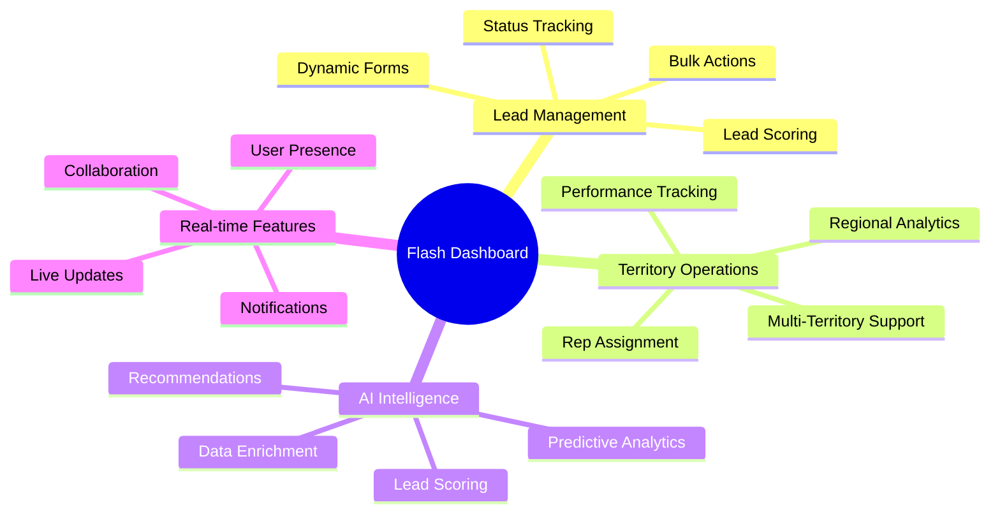

# Features Documentation

Comprehensive guide to Flash Sales Dashboard features, including user guides, configuration options, and best practices for maximizing productivity.

## 📋 Table of Contents

- [Feature Overview](#feature-overview)
- [Dashboard & Analytics](#dashboard--analytics)
- [Lead Management](#lead-management)
- [Territory Management](#territory-management)
- [AI-Powered Features](#ai-powered-features)
- [Real-time Collaboration](#real-time-collaboration)
- [Sales Intelligence](#sales-intelligence)
- [User Management & Roles](#user-management--roles)
- [Reporting & Analytics](#reporting--analytics)
- [Configuration & Settings](#configuration--settings)

## 🎯 Feature Overview

Flash Sales Dashboard is designed to accelerate Bitcoin adoption across Caribbean territories through intelligent lead management and real-time collaboration.

### Core Feature Categories



### Feature Matrix by Territory

| Feature | Jamaica | Cayman Islands | Curaçao |
|---------|---------|----------------|---------|
| **Lead Management** | ✅ Full | ✅ Full | ✅ Full |
| **AI Lead Scoring** | ✅ Full | ✅ Full | ✅ Full |
| **Real-time Updates** | ✅ Full | ✅ Full | ✅ Full |
| **Compliance Tracking** | ✅ Basic | ✅ Enhanced | ✅ Basic |
| **Local Integrations** | ✅ Full | 🟡 Planned | 🟡 Planned |
| **Multi-currency** | ✅ JMD/USD | ✅ KYD/USD | ✅ ANG/USD |

## 📊 Dashboard & Analytics

### Executive Dashboard

The main dashboard provides a comprehensive overview of sales performance across all territories.

#### Key Metrics

- **Total Submissions**: Real-time count of new leads
- **Conversion Rate**: Percentage of leads converted to deals
- **Revenue Pipeline**: Projected revenue from active deals
- **Territory Performance**: Comparative analysis across regions

#### Interactive Widgets

```typescript
// Example: Stats Overview Widget
const StatsOverviewWidget = () => {
  const { data: stats } = useQuery(['dashboard-stats'], fetchDashboardStats);
  
  return (
    <div className="stats-grid">
      <StatCard 
        title="Total Leads"
        value={stats.totalLeads}
        change="+12%"
        trend="up"
        color="green"
      />
      <StatCard 
        title="Active Deals"
        value={stats.activeDeals}
        change="+5%"
        trend="up"
        color="blue"
      />
      <StatCard 
        title="Conversion Rate"
        value={`${stats.conversionRate}%`}
        change="-2%"
        trend="down"
        color="yellow"
      />
      <StatCard 
        title="Revenue"
        value={formatCurrency(stats.revenue)}
        change="+18%"
        trend="up"
        color="purple"
      />
    </div>
  );
};
```

#### Customizable Layout

Users can customize their dashboard layout by:
- **Dragging and dropping widgets**
- **Resizing components**
- **Adding/removing widgets**
- **Saving layout preferences**

### Performance Charts

#### Sales Funnel Visualization
```typescript
const SalesFunnelChart = () => {
  const funnelData = [
    { stage: 'Leads', count: 1000, color: '#22c55e' },
    { stage: 'Qualified', count: 400, color: '#3b82f6' },
    { stage: 'Proposal', count: 150, color: '#f59e0b' },
    { stage: 'Negotiation', count: 75, color: '#ef4444' },
    { stage: 'Closed', count: 45, color: '#8b5cf6' }
  ];
  
  return <FunnelChart data={funnelData} />;
};
```

#### Territory Performance Heatmap
- Visual representation of performance across territories
- Color-coded metrics (leads, conversion rates, revenue)
- Interactive drill-down capabilities

## 🎯 Lead Management

### Dynamic Intake Forms

Smart forms that adapt based on territory and business type:

```typescript
// Territory-specific form fields
const TerritoryFormFields = {
  jamaica: [
    'business_registration_number',
    'tax_registration_number',
    'parish',
    'preferred_language'
  ],
  cayman: [
    'company_registration',
    'regulatory_license',
    'district',
    'compliance_officer'
  ],
  curacao: [
    'chamber_of_commerce_number',
    'tax_id',
    'district',
    'preferred_language'
  ]
};

const DynamicIntakeForm = ({ territory }) => {
  const specificFields = TerritoryFormFields[territory] || [];
  
  return (
    <FormProvider>
      <form>
        {/* Common fields */}
        <ContactInformation />
        <BusinessDetails />
        <InterestAssessment />
        
        {/* Territory-specific fields */}
        {specificFields.map(field => (
          <TerritoryField key={field} name={field} territory={territory} />
        ))}
        
        <SubmitButton />
      </form>
    </FormProvider>
  );
};
```

#### Form Features

1. **Smart Validation**
   - Real-time field validation
   - Territory-specific business rules
   - Email and phone number verification

2. **Auto-completion**
   - Business name suggestions
   - Address auto-complete
   - Industry classification

3. **Progress Tracking**
   - Multi-step form with progress indicator
   - Save and resume functionality
   - Validation status indicators

### Lead Scoring Engine

#### Automatic Scoring Algorithm

```typescript
const calculateLeadScore = (leadData: LeadData): number => {
  let score = 50; // Base score
  
  // Business size factors
  if (leadData.monthlyRevenue) {
    const revenue = parseRevenue(leadData.monthlyRevenue);
    score += Math.min(revenue / 10000 * 20, 30); // Max 30 points
  }
  
  if (leadData.numberOfEmployees) {
    const employees = parseEmployees(leadData.numberOfEmployees);
    score += Math.min(employees / 10 * 15, 20); // Max 20 points
  }
  
  // Interest and engagement
  score += leadData.interestLevel * 2; // 0-20 points
  
  // Pain points relevance
  const relevantPainPoints = leadData.painPoints?.filter(
    point => BITCOIN_RELEVANT_PAIN_POINTS.includes(point)
  ).length || 0;
  score += relevantPainPoints * 5; // 5 points per relevant pain point
  
  // Territory-specific adjustments
  const territoryMultiplier = TERRITORY_MULTIPLIERS[leadData.territory] || 1;
  score *= territoryMultiplier;
  
  return Math.min(Math.max(Math.round(score), 0), 100);
};
```

#### Score Factors Display

```typescript
const LeadScoreCard = ({ lead }) => {
  const scoreFactors = analyzeScoreFactors(lead);
  
  return (
    <div className="lead-score-card">
      <div className="score-display">
        <span className="score-value">{lead.score}</span>
        <span className="score-label">Lead Score</span>
      </div>
      
      <div className="score-factors">
        {scoreFactors.map(factor => (
          <FactorRow 
            key={factor.name}
            name={factor.name}
            impact={factor.impact}
            value={factor.value}
          />
        ))}
      </div>
      
      <div className="score-actions">
        <button onClick={() => recalculateScore(lead.id)}>
          Recalculate Score
        </button>
      </div>
    </div>
  );
};
```

### Lead Status Management

#### Status Workflow

```
New → Contacted → Qualified → Proposal → Negotiation → Closed (Won/Lost)
  ↓      ↓          ↓          ↓          ↓
 Nurture  →  Follow-up  →  Re-engage  →  Archive
```

#### Bulk Actions

```typescript
const BulkActionsToolbar = ({ selectedLeads, onAction }) => {
  const bulkActions = [
    { id: 'status', label: 'Update Status', icon: CheckIcon },
    { id: 'assign', label: 'Assign Rep', icon: UserIcon },
    { id: 'tag', label: 'Add Tags', icon: TagIcon },
    { id: 'export', label: 'Export', icon: DownloadIcon },
    { id: 'delete', label: 'Delete', icon: TrashIcon }
  ];
  
  return (
    <div className="bulk-actions">
      <span className="selection-count">
        {selectedLeads.length} selected
      </span>
      
      {bulkActions.map(action => (
        <button
          key={action.id}
          onClick={() => onAction(action.id, selectedLeads)}
          className="bulk-action-btn"
        >
          <action.icon className="w-4 h-4" />
          {action.label}
        </button>
      ))}
    </div>
  );
};
```

## 🌍 Territory Management

### Multi-Territory Support

Each territory operates with its own:
- **Data isolation** via Row Level Security
- **Customized workflows** and processes
- **Regional compliance** requirements
- **Local currency** and formatting

#### Territory Selector

```typescript
const TerritorySelector = () => {
  const { currentTerritory, setTerritory, availableTerritories } = useTerritory();
  
  return (
    <Select value={currentTerritory} onValueChange={setTerritory}>
      <SelectTrigger className="territory-selector">
        <TerritoryFlag territory={currentTerritory} />
        <span>{TERRITORY_NAMES[currentTerritory]}</span>
      </SelectTrigger>
      
      <SelectContent>
        {availableTerritories.map(territory => (
          <SelectItem key={territory} value={territory}>
            <div className="territory-option">
              <TerritoryFlag territory={territory} />
              <span>{TERRITORY_NAMES[territory]}</span>
              <span className="territory-status">
                {getOnlineCount(territory)} online
              </span>
            </div>
          </SelectItem>
        ))}
      </SelectContent>
    </Select>
  );
};
```

### Performance Tracking

#### Territory Dashboard

```typescript
const TerritoryDashboard = ({ territory }) => {
  const { data: metrics } = useTerritoryMetrics(territory);
  const { data: reps } = useTerritoryReps(territory);
  
  return (
    <div className="territory-dashboard">
      <TerritoryHeader territory={territory} metrics={metrics} />
      
      <div className="dashboard-grid">
        <PerformanceChart data={metrics.timeSeriesData} />
        <LeaderboardWidget reps={reps} />
        <PipelineWidget deals={metrics.deals} />
        <ActivityFeed territory={territory} />
      </div>
    </div>
  );
};
```

#### Rep Performance Leaderboard

- Real-time rep rankings
- Multiple sorting criteria (deals, revenue, activities)
- Achievement badges and milestones
- Performance trends and insights

### Territory Assignment

#### Automatic Lead Routing

```typescript
const LeadRoutingEngine = {
  async assignLead(lead: Lead): Promise<Assignment> {
    const availableReps = await getAvailableReps(lead.territory);
    const routingRules = await getRoutingRules(lead.territory);
    
    // Apply routing rules in priority order
    for (const rule of routingRules) {
      if (rule.condition(lead)) {
        const assignment = rule.assignmentLogic(lead, availableReps);
        if (assignment) {
          await logAssignment(lead.id, assignment, rule.name);
          return assignment;
        }
      }
    }
    
    // Fallback to round-robin
    return this.roundRobinAssignment(lead, availableReps);
  }
};
```

## 🤖 AI-Powered Features

### Intelligent Lead Scoring

#### Machine Learning Model

```typescript
class AILeadScoringService {
  async enhancedScoring(leadData: LeadData): Promise<AIScoreResult> {
    // Collect historical data for similar leads
    const historicalData = await this.getHistoricalComparisons(leadData);
    
    // Apply ML model (when available)
    const mlPrediction = await this.applyMLModel(leadData, historicalData);
    
    // Combine rule-based and ML scores
    const finalScore = this.combineScores(
      this.calculateRuleBasedScore(leadData),
      mlPrediction?.score
    );
    
    return {
      score: finalScore,
      confidence: mlPrediction?.confidence || 0.65,
      factors: this.identifyTopFactors(leadData),
      recommendations: await this.generateRecommendations(leadData),
      predictedOutcome: {
        probability: mlPrediction?.conversionProbability || 0.5,
        timeToClose: mlPrediction?.timeToClose || 30,
        expectedValue: this.calculateExpectedValue(leadData, finalScore)
      }
    };
  }
}
```

#### Predictive Analytics

- **Conversion Probability**: ML-powered prediction of lead conversion likelihood
- **Time to Close**: Estimated days to deal closure
- **Deal Value Prediction**: Expected revenue from the lead
- **Churn Risk Assessment**: Likelihood of lead going cold

### Smart Recommendations

#### Follow-up Suggestions

```typescript
const generateFollowUpRecommendations = (lead: Lead): Recommendation[] => {
  const recommendations = [];
  
  // Time-based recommendations
  if (daysSinceLastContact(lead) > 7) {
    recommendations.push({
      type: 'follow_up',
      priority: 'high',
      action: 'Schedule follow-up call',
      reason: 'No contact in over a week',
      suggestedTime: getOptimalContactTime(lead)
    });
  }
  
  // Interest-based recommendations
  if (lead.interestLevel > 8 && !lead.demoScheduled) {
    recommendations.push({
      type: 'demo',
      priority: 'high',
      action: 'Schedule product demo',
      reason: 'High interest level detected',
      suggestedContent: getRelevantDemoContent(lead)
    });
  }
  
  // Content recommendations
  const contentSuggestions = getRelevantContent(lead);
  recommendations.push({
    type: 'content',
    priority: 'medium',
    action: 'Send educational content',
    reason: 'Build trust and educate',
    content: contentSuggestions
  });
  
  return recommendations;
};
```

### Data Enrichment

#### Automatic Enhancement

```typescript
class DataEnrichmentService {
  async enrichLead(lead: Lead): Promise<EnrichedLead> {
    const enrichedData = await Promise.allSettled([
      this.enrichCompanyData(lead.businessName),
      this.enrichContactData(lead.email),
      this.enrichLocationData(lead.address),
      this.enrichIndustryData(lead.businessType)
    ]);
    
    return {
      ...lead,
      enrichedData: {
        company: enrichedData[0].status === 'fulfilled' ? enrichedData[0].value : null,
        contact: enrichedData[1].status === 'fulfilled' ? enrichedData[1].value : null,
        location: enrichedData[2].status === 'fulfilled' ? enrichedData[2].value : null,
        industry: enrichedData[3].status === 'fulfilled' ? enrichedData[3].value : null
      },
      enrichmentStatus: 'completed',
      lastEnriched: new Date().toISOString()
    };
  }
}
```

## 🔄 Real-time Collaboration

### Live User Presence

#### Presence Indicators

```typescript
const PresenceIndicator = ({ userId }) => {
  const presence = useUserPresence(userId);
  
  if (!presence) return null;
  
  return (
    <div className="presence-indicator">
      <div className={`status-dot status-${presence.status}`} />
      <span className="status-text">
        {presence.status === 'online' ? 'Online' : 
         presence.status === 'away' ? 'Away' : 'Offline'}
      </span>
      {presence.currentPage && (
        <span className="current-page">
          Viewing: {presence.currentPage}
        </span>
      )}
    </div>
  );
};
```

#### Real-time Cursors

```typescript
const RealtimeCursors = ({ documentId }) => {
  const { cursors } = useRealtimeCursors(documentId);
  
  return (
    <div className="cursor-layer">
      {cursors.map(cursor => (
        <Cursor
          key={cursor.userId}
          position={cursor.position}
          user={cursor.user}
          color={cursor.color}
        />
      ))}
    </div>
  );
};
```

### Real-time Updates

#### Live Data Synchronization

```typescript
const useRealtimeLeads = (territory: string) => {
  const [leads, setLeads] = useState<Lead[]>([]);
  
  useEffect(() => {
    // Initial fetch
    fetchLeads(territory).then(setLeads);
    
    // Real-time subscription
    const subscription = supabase
      .channel(`leads:${territory}`)
      .on('postgres_changes', {
        event: '*',
        schema: 'public',
        table: 'submissions',
        filter: `territory=eq.${territory}`
      }, (payload) => {
        handleLeadUpdate(payload, setLeads);
      })
      .subscribe();
      
    return () => {
      supabase.removeChannel(subscription);
    };
  }, [territory]);
  
  return leads;
};
```

### Collaborative Features

#### Shared Notes

```typescript
const SharedNotes = ({ leadId }) => {
  const { notes, addNote, updateNote } = useSharedNotes(leadId);
  const [newNote, setNewNote] = useState('');
  
  return (
    <div className="shared-notes">
      <div className="notes-list">
        {notes.map(note => (
          <NoteItem
            key={note.id}
            note={note}
            onUpdate={updateNote}
            collaborative={true}
          />
        ))}
      </div>
      
      <div className="add-note">
        <textarea
          value={newNote}
          onChange={(e) => setNewNote(e.target.value)}
          placeholder="Add a note... (others will see this in real-time)"
        />
        <button onClick={() => addNote(newNote)}>
          Add Note
        </button>
      </div>
    </div>
  );
};
```

## 🧠 Sales Intelligence

### Deal Probability Analysis

#### Probability Calculator

```typescript
const calculateDealProbability = (deal: Deal): ProbabilityAnalysis => {
  const factors = [
    {
      name: 'Lead Score',
      weight: 0.3,
      value: deal.leadScore / 100,
      impact: deal.leadScore > 70 ? 'positive' : 'negative'
    },
    {
      name: 'Engagement Level',
      weight: 0.25,
      value: calculateEngagement(deal.activities),
      impact: 'positive'
    },
    {
      name: 'Time in Pipeline',
      weight: 0.2,
      value: calculateTimeScore(deal.createdAt),
      impact: daysSinceCreated(deal) > 30 ? 'negative' : 'positive'
    },
    {
      name: 'Budget Fit',
      weight: 0.15,
      value: calculateBudgetFit(deal.estimatedValue, deal.budget),
      impact: 'positive'
    },
    {
      name: 'Decision Maker Access',
      weight: 0.1,
      value: deal.hasDecisionMakerContact ? 1 : 0.5,
      impact: deal.hasDecisionMakerContact ? 'positive' : 'negative'
    }
  ];
  
  const weightedScore = factors.reduce((sum, factor) => 
    sum + (factor.value * factor.weight), 0
  );
  
  return {
    probability: Math.round(weightedScore * 100),
    confidence: calculateConfidence(factors),
    factors,
    recommendations: generateDealRecommendations(deal, factors)
  };
};
```

### Follow-up Recommendations

#### Smart Scheduling

```typescript
const FollowUpRecommendations = ({ lead }) => {
  const recommendations = useFollowUpRecommendations(lead);
  
  return (
    <div className="follow-up-recommendations">
      <h3>Recommended Actions</h3>
      
      {recommendations.map(rec => (
        <RecommendationCard
          key={rec.id}
          recommendation={rec}
          onExecute={() => executeRecommendation(rec, lead)}
        />
      ))}
      
      <div className="quick-actions">
        <button onClick={() => scheduleCall(lead)}>
          📞 Schedule Call
        </button>
        <button onClick={() => sendEmail(lead)}>
          ✉️ Send Email
        </button>
        <button onClick={() => setReminder(lead)}>
          ⏰ Set Reminder
        </button>
      </div>
    </div>
  );
};
```

### Pipeline Analytics

#### Advanced Reporting

```typescript
const PipelineAnalytics = ({ territory, dateRange }) => {
  const { data: analytics } = usePipelineAnalytics(territory, dateRange);
  
  const insights = [
    {
      title: 'Conversion Bottleneck',
      insight: analytics.bottleneckStage,
      action: 'Focus training on qualification skills',
      impact: 'Could improve conversion by 15%'
    },
    {
      title: 'Optimal Follow-up Time',
      insight: `${analytics.optimalFollowUpTime} days`,
      action: 'Adjust follow-up schedule',
      impact: 'Increase response rate by 8%'
    },
    {
      title: 'High-Value Opportunity',
      insight: `${analytics.highValueLeads} leads >$50k`,
      action: 'Assign to senior reps',
      impact: 'Protect high-value deals'
    }
  ];
  
  return (
    <div className="pipeline-analytics">
      <AnalyticsChart data={analytics.funnelData} />
      
      <div className="insights-panel">
        <h3>AI Insights</h3>
        {insights.map(insight => (
          <InsightCard key={insight.title} {...insight} />
        ))}
      </div>
    </div>
  );
};
```

## 👥 User Management & Roles

### Role-Based Access Control

#### Role Definitions

```typescript
const ROLES = {
  admin: {
    name: 'Administrator',
    permissions: [
      'view_all_territories',
      'manage_users',
      'access_admin_panel',
      'configure_system',
      'view_all_reports'
    ],
    territories: ['all']
  },
  manager: {
    name: 'Territory Manager',
    permissions: [
      'view_territory_data',
      'manage_territory_reps',
      'assign_leads',
      'view_territory_reports'
    ],
    territories: ['assigned']
  },
  rep: {
    name: 'Sales Representative',
    permissions: [
      'view_assigned_leads',
      'update_lead_status',
      'create_activities',
      'view_own_performance'
    ],
    territories: ['assigned']
  }
};
```

#### Permission Checks

```typescript
const usePermissions = () => {
  const { user } = useAuth();
  
  const hasPermission = (permission: string): boolean => {
    const userRole = ROLES[user?.role];
    return userRole?.permissions.includes(permission) || false;
  };
  
  const canAccessTerritory = (territory: string): boolean => {
    const userRole = ROLES[user?.role];
    return userRole?.territories.includes('all') || 
           user?.territories?.includes(territory) || false;
  };
  
  return { hasPermission, canAccessTerritory };
};

// Usage in components
const AdminPanel = () => {
  const { hasPermission } = usePermissions();
  
  if (!hasPermission('access_admin_panel')) {
    return <AccessDenied />;
  }
  
  return <AdminPanelContent />;
};
```

### User Onboarding

#### Interactive Tutorial

```typescript
const OnboardingFlow = () => {
  const { currentStep, nextStep, skipTour } = useOnboarding();
  
  const tourSteps = [
    {
      target: '.dashboard-overview',
      content: 'Welcome! This is your dashboard overview where you can see key metrics.',
      placement: 'bottom'
    },
    {
      target: '.territory-selector',
      content: 'Switch between territories here to view regional data.',
      placement: 'bottom'
    },
    {
      target: '.leads-table',
      content: 'Manage all your leads from this central table.',
      placement: 'top'
    },
    {
      target: '.ai-score-indicator',
      content: 'AI-powered lead scores help prioritize your efforts.',
      placement: 'left'
    }
  ];
  
  return (
    <Joyride
      steps={tourSteps}
      stepIndex={currentStep}
      callback={handleTourCallback}
      showProgress
      showSkipButton
      styles={tourStyles}
    />
  );
};
```

## 📈 Reporting & Analytics

### Custom Reports

#### Report Builder

```typescript
const ReportBuilder = () => {
  const [reportConfig, setReportConfig] = useState({
    type: 'leads',
    dateRange: 'last_30_days',
    groupBy: 'territory',
    metrics: ['count', 'conversion_rate'],
    filters: {}
  });
  
  const { data: reportData } = useCustomReport(reportConfig);
  
  return (
    <div className="report-builder">
      <ReportConfiguration 
        config={reportConfig}
        onChange={setReportConfig}
      />
      
      <ReportVisualization 
        data={reportData}
        config={reportConfig}
      />
      
      <ReportActions 
        onExport={() => exportReport(reportData, reportConfig)}
        onSave={() => saveReport(reportConfig)}
        onSchedule={() => scheduleReport(reportConfig)}
      />
    </div>
  );
};
```

### Automated Insights

#### Daily/Weekly Reports

```typescript
const AutomatedReports = {
  async generateDailyReport(territory: string): Promise<DailyReport> {
    const yesterday = new Date();
    yesterday.setDate(yesterday.getDate() - 1);
    
    const metrics = await this.calculateDailyMetrics(territory, yesterday);
    const insights = await this.generateInsights(metrics);
    const recommendations = await this.generateRecommendations(territory, metrics);
    
    return {
      date: yesterday.toISOString(),
      territory,
      metrics,
      insights,
      recommendations,
      generatedAt: new Date().toISOString()
    };
  },
  
  async emailReport(report: DailyReport, recipients: string[]) {
    const emailContent = this.formatReportEmail(report);
    await sendEmail({
      to: recipients,
      subject: `Daily Sales Report - ${report.territory}`,
      html: emailContent,
      attachments: [
        {
          filename: `daily-report-${report.date}.pdf`,
          content: await this.generateReportPDF(report)
        }
      ]
    });
  }
};
```

## ⚙️ Configuration & Settings

### System Configuration

#### Feature Flags

```typescript
const FeatureFlags = {
  realtime: {
    enabled: process.env.NEXT_PUBLIC_ENABLE_REALTIME === 'true',
    description: 'Real-time updates and collaboration features'
  },
  aiFeatures: {
    enabled: process.env.NEXT_PUBLIC_ENABLE_AI_FEATURES === 'true',
    description: 'AI-powered lead scoring and recommendations'
  },
  advancedAnalytics: {
    enabled: process.env.NEXT_PUBLIC_ENABLE_ANALYTICS === 'true',
    description: 'Advanced reporting and predictive analytics'
  }
};

// Usage
const AIFeatures = () => {
  if (!FeatureFlags.aiFeatures.enabled) {
    return <FeatureDisabledMessage feature="AI Features" />;
  }
  
  return <AILeadScoringWidget />;
};
```

#### Territory Configuration

```typescript
const TerritoryConfig = {
  jamaica: {
    name: 'Jamaica',
    currency: 'JMD',
    timezone: 'America/Jamaica',
    workingHours: { start: '09:00', end: '17:00' },
    compliance: {
      required: ['business_registration', 'tax_number'],
      optional: ['trade_license']
    },
    integrations: {
      banking: ['ncb', 'sagicor', 'jmmb'],
      payment: ['lynk', 'paymaster']
    }
  },
  cayman: {
    name: 'Cayman Islands',
    currency: 'KYD',
    timezone: 'America/Cayman',
    workingHours: { start: '08:30', end: '17:30' },
    compliance: {
      required: ['company_registration', 'regulatory_license'],
      optional: ['beneficial_ownership']
    },
    integrations: {
      banking: ['cayman_national', 'butterfield'],
      compliance: ['cima_reporting']
    }
  }
};
```

### User Preferences

#### Customizable Settings

```typescript
const UserSettings = () => {
  const { settings, updateSettings } = useUserSettings();
  
  return (
    <div className="user-settings">
      <SettingsSection title="Display">
        <ThemeSelector 
          value={settings.theme}
          onChange={(theme) => updateSettings({ theme })}
        />
        <LanguageSelector 
          value={settings.language}
          onChange={(language) => updateSettings({ language })}
        />
      </SettingsSection>
      
      <SettingsSection title="Notifications">
        <NotificationPreferences 
          settings={settings.notifications}
          onChange={(notifications) => updateSettings({ notifications })}
        />
      </SettingsSection>
      
      <SettingsSection title="Dashboard">
        <DashboardLayoutEditor 
          layout={settings.dashboardLayout}
          onChange={(layout) => updateSettings({ dashboardLayout: layout })}
        />
      </SettingsSection>
    </div>
  );
};
```

---

## 🎓 Best Practices

### Feature Usage Guidelines

1. **Lead Management**
   - Review and update lead scores regularly
   - Use bulk actions for efficient processing
   - Keep notes updated for team collaboration

2. **Territory Operations**
   - Monitor cross-territory performance metrics
   - Ensure proper lead routing and assignment
   - Regular training on territory-specific compliance

3. **AI Features**
   - Trust the AI recommendations but validate with human judgment
   - Provide feedback to improve scoring accuracy
   - Use predictive insights for strategic planning

4. **Real-time Collaboration**
   - Communicate status changes promptly
   - Use shared notes for important updates
   - Respect others' work and avoid conflicts

## 📞 Feature Support

For feature-specific questions:

- **📖 Documentation**: This guide and inline help
- **🎥 Training Videos**: Available in the help section
- **💬 Community**: Feature discussions and tips
- **🐛 Bug Reports**: Report feature issues on GitHub

The Flash Sales Dashboard is continuously evolving based on user feedback and Caribbean market needs. Regular updates bring new features and improvements to support Bitcoin adoption across the region.